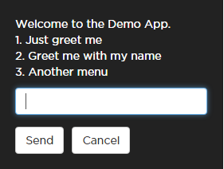
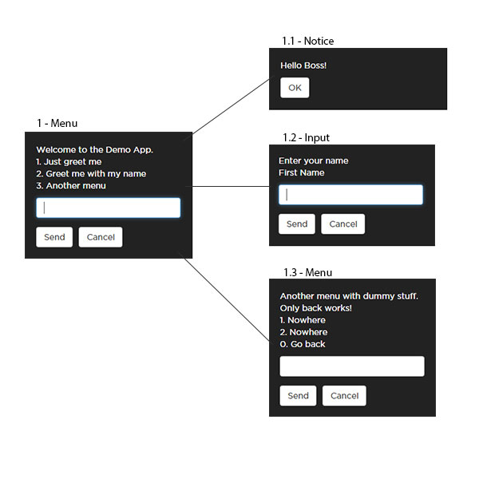

# USSD Framework

A .NET framework to ease building USSD clients on the [SMSGH](http://www.smsgh.com) [USSD platform](http://developers.smsgh.com/documentations/ussd).

## Features

* Automated USSD session management.
* Automated USSD screen navigation. All sub-menus can go back to a previous screen when a user input's `0`
* Automagically resume timed out USSD sessions.
* Automagically collect user input for specific actions.
* Encrypt inputs.
* Fully asynchronous.

## Dependencies

* [Redis](https://github.com/MSOpenTech/redis): This is used to keep session state. It is self-managed by the framework.

## Installation

Install from [NuGet](http://nuget.org) via Package Manager Console.

```
PM> Install-Package UssdFramework
```

## Demo

A demo project is included in the [source](http://github.com/smsgh/ussd-framework).

This project provides a quick look into how an ASP.NET Web API application can implement the USSD Framework.

The project is configured to run on a local version of IIS at [http://localhost/UssdFrameworkDemo](http://localhost/UssdFrameworkDemo).

You can use [ussd-mocker](http://github.com/smsgh/ussd-mocker) to interact with the demo app by using `http://127.0.0.1/UssdFrameworkDemo` as _USSD Client URL_.

## Basic Concepts

To make the most of the USSD Framework there are a few basic concepts that one must be familiar with.

### USSD Screen Types

A USSD app displays various screens to a user. These screens are grouped into 3 main categories:

* __Menu__: A menu view where a user enters a number/input to navigate to another screen.
* __Notice__: A view that displays some information to a user and ends the session.
* __Input__: A view or series of views used to collect user input.

### USSD Screen Addresses

For the USSD Framework to know which screen to work with at a particular instance we assign addresses to each screen. The addresses use dot-notation.

For instance, with the Demo app, the start screen has address `1` and is a _Menu_. __Note__: Mostly the start screen will be of _Menu_ type.



The menu has 3 options which lead to various screens:

1. __Just greet me__: _Notice_
2. __Greet me with my name__: _Input_
3. __Another menu__: _Menu_

So chosing `1` will take us to another screen with an address of `1.1` which is of type _Notice_.

Screen flow diagram:




## Documentation

<!-- * __Tutorial__: A step-by-step tutorial recreating the demo app can be found [here](docs/tutorial.md). -->
* __API__: Open `UssdFramework.ApiDocs\Help\index.html` in a browser to view API documentation. Documentation is generated using [Sandcastle](http://shfb.codeplex.com).
