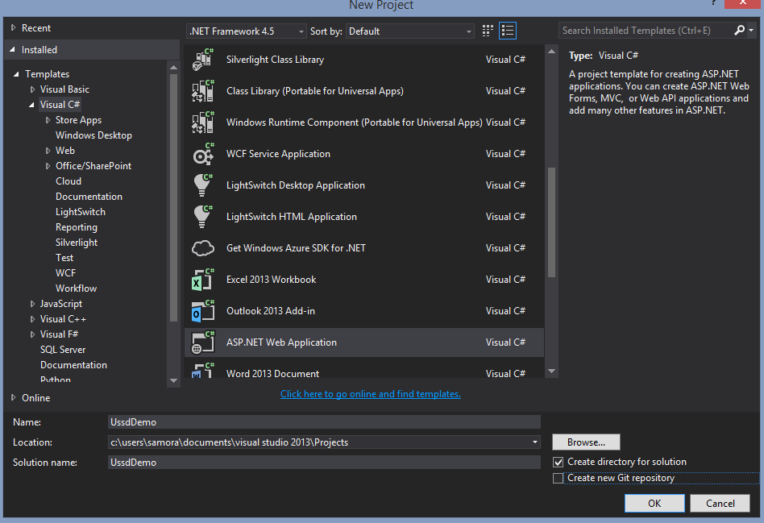
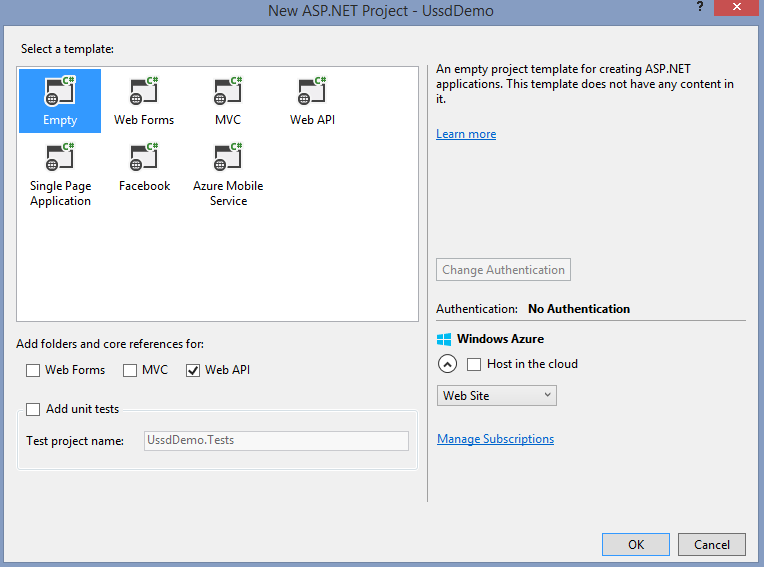

# USSD Framework Tutorial (Note: Incomplete)

This is a step-by-step walkthrough to create a basic USSD client. The tutorial uses Visual Studio 2013 on .NET Framework 4.5.

Ensure you have Redis installed. The Windows port can be found [here](https://github.com/MSOpenTech/redis).

The following flow diagram shows the result we are aiming for:


## Create a new project

Create an empty ASP.NET Web API project and name it `UssdDemo`.





## Install UssdFramework package from NuGet

Open Package Manager Console and install `UssdFramework` from [NuGet](http://nuget.org).

```
PM> Install-Package UssdFramework
```

## Add Default controller

* Right-click `Controllers` folder and select __Add>Controller__. 
* Chose __Web API 2 Controller - Empty__ and click __Add__.
* Set _Controller name_ as `DefaultController` and click __Add__.

## Modify routes

All requests from the SMSGH USSD service will hit the same endpoint. We need to configure our routes to reflect this.

Modify `App_Start\WebApiConfig.cs` to look like this;

```c#
using System;
using System.Collections.Generic;
using System.Linq;
using System.Web.Http;

namespace UssdDemo
{
    public static class WebApiConfig
    {
        public static void Register(HttpConfiguration config)
        {
            config.MapHttpAttributeRoutes();
            config.Routes.MapHttpRoute(
                name: "DefaultApi",
                routeTemplate: "{controller}/{action}",
                defaults: new
                {
                    controller = "Default",
                    action = "Index",
                }
            );
        }
    }
}
```


## Prepare main menu USSD Screen

In `Models` folder, add `ScreenResponses` folder. `ScreenResponses` will contain all the responses for the various screens.

Create 3 classes in `ScreenResponses`; `Menus.cs`, `Inputs.cs` and `Notices.cs`.

In `Models\ScreenResponses\Menus.cs` add a static method that will provide the main menu's response;

```c#
using System;
using System.Threading.Tasks;
using UssdFramework;

namespace UssdDemo.Models.ScreenResponses
{
    public class Menus
    {
        public static async Task<UssdResponse> MainMenu(Session session)
        {
            return UssdResponse.Menu(
                "Welcome to the Demo App." + Environment.NewLine
                  + "1. Just greet me" + Environment.NewLine
                  + "2. Greet me with my name" + Environment.NewLine
                  + "3. Another menu");
        }
    }
}
```

Note the signature of the method. All responses follow this pattern. 

The `session` object is also available at runtime and contains all information about the session including request data.


Now we need to setup our screens' meta data to allow our session to know how to process each screen. To do that we create a dictionary store of the type `Dictionary<string, UssdScreen>`.

Create a `Screens.cs` class in `Models` folder that looks like the following;

```c#
using System.Collections.Generic;
using UssdFramework;

namespace UssdDemo.Models
{
    public class Screens
    {
        public static Dictionary<string, UssdScreen> All = new Dictionary<string, UssdScreen>();

        static Screens()
        {
            All.Add("1", new UssdScreen()
            {
                Title = "Main menu",
                Type = UssdScreenTypes.Menu,
                RespondAsync = ScreenResponses.Menus.MainMenu,
            });
        }
    }
}
```

In the static initializer we add an entry to the dictionary that represents the main menu's screen. The _key_ is a `string` representing the screen's address and the _value_ is a `UssdScreen` object with the following properties:
* __Title__
* __Type__: Enum of `UssdScreenTypes.Menu`, `UssdScreenTypes.Input` or `UssdScreen.Notice`
* __RespondAsync__: Delegate method to a screen response.

There are 2 other properties that need to be set when the screen is of type `UssdScreenTypes.Input`:
* __Inputs__: A list of input names as strings.
* __InputProcessorAsync__: Delegate method to an input processor.


## Setup the controller

Now to start receiving requests we just have to setup a controller action.

```c#
using System.Threading.Tasks;
using System.Web.Http;
using UssdDemo.Models;
using UssdFramework;

namespace UssdDemo.Controllers
{
    public class DefaultController : ApiController
    {
        private readonly Setup _setup = new Setup("DemoApp", "localhost", Screens.All);

        [HttpPost]
        public async Task<IHttpActionResult> Index(UssdRequest ussdRequest)
        {
            var session = new Session(_setup, ussdRequest);
            switch (ussdRequest.Type)
            {
                case "Initiation":
                    var exists = await session.ExistsAndTimedOutAsync();
                    if (exists) await session.ResumeAsync();
                    else await session.StartAsync("1");
                    break;
                case "Response":
                    await session.ContinueAsync();
                    break;
                case "Release":
                    await session.EndAsync();
                    break;
                case "Timeout":
                    await session.TimeoutAsync();
                    break;
                default:
                    return Ok(UssdResponse.Generate(UssdResponseTypes.Release
                        , "Failed to setup session. Check the Type parameter of USSD request."));
            }
            return Ok(await session.RespondAsync());
        }  
    }
}
```

We create a private instance of `UssdFramework.Setup` that we pass to `UssdFramework.Session` along with the `UssdRequest` object.